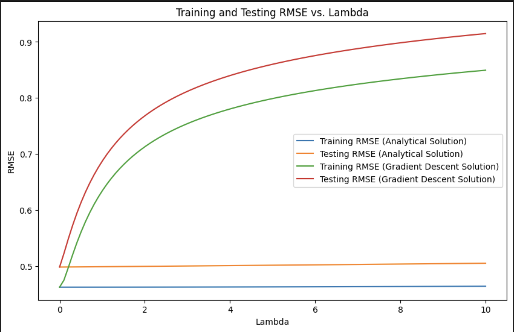
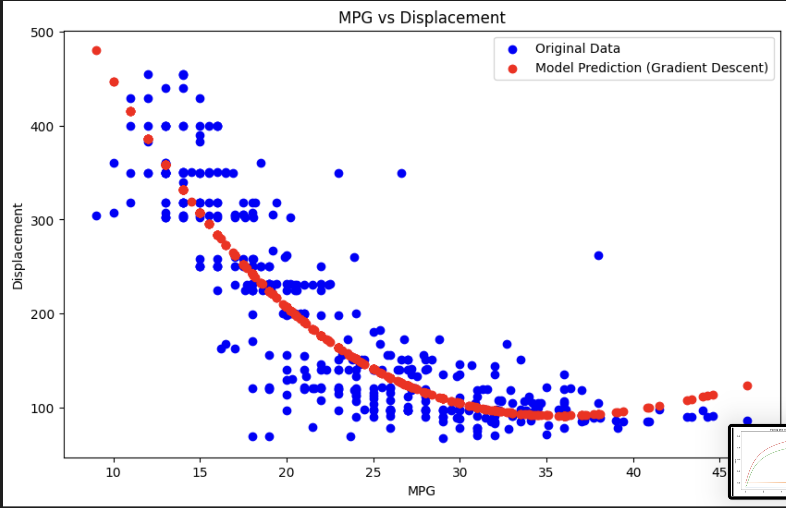

# Hi, I'm Haris! 👋


[](https://choosealicense.com/licenses/mit/) 


# Logistic Regression Assignment

This Jupyter Notebook explores the concepts of Logistic Regression and Ridge Regression, with a particular focus on building a classifier to categorize celestial objects as either stars, galaxies, or quasars. The notebook is structured to provide a comprehensive understanding of these regression techniques, and includes practical implementations, visualizations, and model evaluations. <br> 

The Logistic Regression folder contains the following files:
- A .ipynb file (Jupyter Notebook) that contains all the code regarding the assignment including text blocks explaining portions of the code
- A corresponding .py file
- seven .png files that are screenshots of the plots in the Jupyter Notebook
- a star_classification.csv file that contains the raw data for the Logistic Regression part of the assignment
- an auto_mpg.csv file that contains the raw data for the Ridge Regression part of the assignmenton. You can download and save the .csv files in your computer and open them as Excel files for better readability.


## Table of Contents

1. [Introduction](#introduction)
2. [Installation Requirements](#installation-requirements)
3. [Project Structure](#project-structure)
4. [Data](#data)
5. [Training and Evaluation](#training-and-visualization)
6. [Lessons](#lessons)
7. [Screenshots](#screenshots)
   
## Introduction

Logistic regression is a statistical method used for binary or multi-class classification that models the relationship between a dependent binary variable and one or more independent variables. Unlike linear regression, which predicts continuous outcomes, logistic regression predicts the probability of an outcome.

 This assignment provides a clear and concise example of how to implement multi-class logistic regression from scratch using Python.
## Installation Requirements

To run this notebook, you will need the following packages:
- numpy
- pandas
- matplotlib
- scikit-learn

You can install these packages using pip:

```bash
 pip install numpy
```
```bash
 pip install pandas
```
```bash
 pip install matplotlib 
```
```bash
 pip install scikit-learn
```

Useful Links for installing Jupyter Notebook:
- https://youtube.com/watch?v=K0B2P1Zpdqs  (MacOS)
- https://www.youtube.com/watch?v=9V7AoX0TvSM (Windows)

It's recommended to run this notebook in a conda environment to avoid dependency conflicts and to ensure smooth execution.
<h4> Conda Environment Setup </h4>
<ul> 
   <li> Install conda </li>
   <li> Open a terminal/command prompt window in the assignment folder. </li>
   <li> Run the following command to create an isolated conda environment titled AI_env with the required packages installed: conda env create -f environment.yml </li>
   <li> Open or restart your Jupyter Notebook server or VSCode to select this environment as the kernel for your notebook. </li>
   <li> Verify the installation by running: conda list -n AI_env </li>
   <li> Install conda </li>
</ul>


## Project Structure

The notebook is organized into the following sections:
<ul>
<li> Introduction: Overview of the project and logistic regression.  </li> <br> 
   
<li> Task 1A: Multinomial Logistic Regression <br>
&emsp; 1) Data Loading and Preprocessing: Steps to load and preprocess the dataset. <br>
&emsp; 2) Model Training: Training the logistic regression model. <br>
&emsp; 3) Model Evaluation: Evaluating the model performance. </li> <br> 


<li> Task 1B: Reflection Questions related to the logistic regression task </li> <br> 
<li>
Task 2: Ridge Regression <br>
&emsp; 1) Data Loading and Preprocessing: Steps to load and preprocess the dataset. <br>
&emsp; 2) Model Training: Training the ridge regression model. <br>
&emsp; 3) Model Evaluation: Evaluating the model performance using plots and some reflection questions </li> <br>

</ul>


## Data

The dataset for the first task is provided in a csv titled `star_classification.csv`. It consists of 100,000 observations of space taken by the SDSS (Sloan Digital Sky Survey). Every observation is described by 17 feature columns and 1 class column which identifies it to be either a star, galaxy or quasar.  <br> 

 Dataset Summary:
- **Feature Type:** Varies
- **Instances:** 100,000
- **Input Features:** 17 
- **Output:** Class
<br>
The dataset for the second part is provided in a .csv file titled `auto_mpg.csv`. <br>
 Dataset Summary:
- **Feature Type:** Varies
- **Instances:** 398
- **Input Feature:** mpg
- **Output:** displacement


## Training and Visualization

The entire training process alongside the maths involved is explained in detail in the jupyter notebook. 
- Note: A good knowledge of Calculus is required to fully understand the gradient descent algorithm, especially the concept of partial derivatives.


## Lessons

A linear regression project can teach a variety of valuable skills and concepts, including:

- Data Preprocessing: How to clean and prepare data for analysis, including handling missing values, scaling features, and encoding categorical variables.

- Feature Selection: Identifying which features (variables) are most important for making predictions and how to choose them effectively.

- Model Building: Understanding how to build a linear regression model, including splitting data into training and testing sets, fitting the model, and making predictions.

- Performance Evaluation: Using metrics like Root Mean Squared Error (RMSE) to evaluate the performance of your model and understand its accuracy.

- Interpreting Results: Understanding the coefficients of the linear regression model and what they signify in terms of the relationships between variables.

- Visualization: Using visualization tools to plot data, visualize the regression line, and understand the relationship between variables.

- Algorithm Implementation: Learning about the underlying algorithm used in linear regression and how it optimizes the line of best fit.


## Screenshots
<h3> (a) Univariate Linear Regression </h3>
<h4> 1. This image shows a regression line and the data points of the <strong> training dataset </strong>, where Present_Tmax is plotted on the x-axis and Next_Tmax is plotted on the y-axis. </h4>
 <br> 

<h4> 2. This image shows a regression line and the data points of the <strong> testing dataset </strong>, where Present_Tmax is plotted on the x-axis and Next_Tmax is plotted on the y-axis. </h4>
 <br> 

<h4> 3. This image shows the correlation between the various input variables in the .csv file and the output variable (Next_Tmax). More details about correlation are in the Jupyter Notebook. </h4>
 <br>

<h4> 4. This image shows a regression line and the data points of the <strong> training dataset </strong>, where the input variable having the highest correlation with the output variable (LDAPS_Tmax_lapse) is plotted on the x-axis and Next_Tmax is plotted on the y-axis. </h4>
 <br>

<h4> 5. This image shows a regression line and the data points of the <strong> testing dataset </strong>, where the input variable having the highest correlation with the output varaible (LDAPS_Tmax_lapse) is plotted on the x-axis and Next_Tmax is plotted on the y-axis. </h4>
 <br> <br> <br>

<h3> (b) Multivariate Linear Regression </h3>
<h4> 1. This image shows the number of epochs on the x-axis plotted against the cost value on the y-axis, when the <strong>top five </strong> input features from the raw dataset are used in the gradient descent algorithm.</h4>
 <br>

<h4> 2. This image shows the number of epochs on the x-axis plotted against the cost value on the y-axis, when <strong> ALL </strong> the input features from the raw dataset are used in the gradient descent algorithm.</h4>


## License

[MIT](https://choosealicense.com/licenses/mit/)
